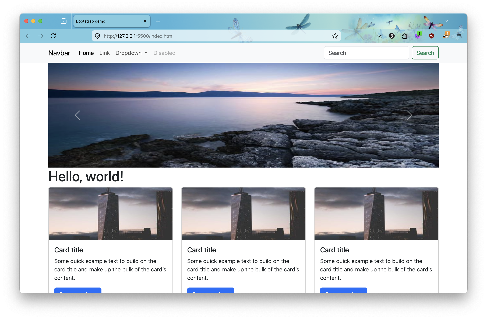

## 什麼是 CSS 框架？

謝謝 AI 幫我選了這麼一個有大師風範的標題，整個專業度拉滿。

指南談不上，但是說說框架的好處是沒問題的。

那麼，什麼是 CSS 框架？其實用框架這個詞已經說明了一切，說明白一點，就是為了提升效率，先把一套構築好的程式碼套進去，這就是框架。

如果你反應不錯，你可能會發現這樣似乎會產生一個問題，先寫好的程式碼可以直接套上去自然是不錯，但是這樣不會造成專案裡面多塞了很多檔案，進一步導致效能低落。

的確會有這種可能，但是考慮到可以大幅縮短開發的時程，那時候的工程師傾向這麼做，而這麼做確實也提供許多好處，不需要每次都重新造輪子，而且也會透過一些手段來處理程式肥大、效能低落的問題，並且冗余的程式碼體積，實際上也並沒有一些多媒體檔案來的大。

最大的好處是可以有效的縮短開發時程，正所謂「 天下武功，唯快不破 」就是這個道理，自然而然有了使用的框架的絕對理由。

## 什麼是 Boostrap？

這裡選擇介紹 Boostrap 這個框架，理由是最熱門的框架之一，許多常用的元件都已經製作好了，並且經過完善的測試，雖然會有我們上一節提到的一些缺點，且除了 Boostrap 以外，也有其他相當優秀的框架，但是 Bootstrap 無疑是個入門的好選項。

以下是 Bootstrap 的自我介紹

> Bootstrap <br>
> Powerful, extensible, and feature-packed frontend toolkit. Build and customize with Sass, utilize prebuilt grid system and components, and bring projects to life with powerful JavaScript plugins.

Bootstrap 其實就是將一些常見的功能打包好，例如：格線系統、元件 ⋯⋯ 等等。

在那個還在手寫程式碼的年代，程式碼是要透過人眼維護的，所以許多程式碼如果不在撰寫的同時，將程式碼進行有系統的整理，把一些常見的樣式進行元件化，例如：卡片、按鈕、Modal ⋯⋯ 等等，程式碼會隨著專案的進程，逐漸變得體積越來越龐大，以至於最後難以維護，大型的專案甚至可能出現數萬行的程式碼都算是小意思。

所以隨著技術的進步，有些把這些歸納出來的，常見的元件以及設計方法整合在一起，並且透過一些檔案打包的技術手段，最終產生了 Bootstrap 這樣便於開發的工具框架。

## 怎麼使用 Bootstrap？

Bootstrap 有兩種方式可供使用，一是透過（Content Delivery Network），二是透過套件管理工具（Package Managers），將檔案下載到本地端。

下面由於是介紹，會使用 CDN，也建議你首次嘗試使用 CDN 即可，可以快速的體驗一下使用 Bootstrap 的快樂。

```html
<!doctype html>
<html lang="en">
  <head>
    <meta charset="utf-8">
    <meta name="viewport" content="width=device-width, initial-scale=1">
    <title>Bootstrap demo</title>
    <link href="https://cdn.jsdelivr.net/npm/bootstrap@5.3.8/dist/css/bootstrap.min.css" rel="stylesheet" integrity="sha384-sRIl4kxILFvY47J16cr9ZwB07vP4J8+LH7qKQnuqkuIAvNWLzeN8tE5YBujZqJLB" crossorigin="anonymous">
  </head>
  <body>
    <h1>Hello, world!</h1>
    <script src="https://cdn.jsdelivr.net/npm/bootstrap@5.3.8/dist/js/bootstrap.bundle.min.js" integrity="sha384-FKyoEForCGlyvwx9Hj09JcYn3nv7wiPVlz7YYwJrWVcXK/BmnVDxM+D2scQbITxI" crossorigin="anonymous"></script>
  </body>
</html>
```

上面是參考的範例程式碼，你可以自行到官方複製 CDN 的連結，Bootstrap 的 CDN 連結有兩個，一個是 CSS，一個是 JS，如果你不清處要放哪裡，興許你應該先回去學學 CSS 以及 JS 的引入方式。

簡單的說明，在 `title` 元素之後的 `link` 元素就是 CSS 的 CDN 連結，通常 JS 都會放置於 `body` 元素的最後面，以避免 DOM 元素無法被順利讀取。

下面是使用一些 Bootstrap 元件的範例圖。



雖然圖片有點變形，不過是為了盡可能呈現比較多元件在畫面上所做的調整，你可以思考一下，如果你只用 CSS 你需要花費多少時間，才能製作這樣的版型，但是使用 Bootstrap 製作出這樣的雛形，只要幾分鐘的時間，且只需要小幅度的修改。

## CDN 與套件管理工具的差別？

上面我們範例使用的是 CDN，這可以最快速的讓我們嘗試一些 Bootstrap 的功能、特色，但是實際開發的時候，我們可能會需要透過套件管理工具，將原始的檔案下載下來，也就是所謂的原始碼，並且進一步客製化。

Bootstrap 是透過 Sass 這個 CSS 預處理器進行編寫的，有機會我們會來說說使用 Sass 進行管理 CSS。

總之，Bootstrap 透過 Sass 編譯好的 CSS 檔案，直接打包到一個伺服器上面，然後透過所謂的 CDN，也就是我們上面使用的 CDN 連結，直接將這個 CSS 引入到我們的檔案中，這種做法是沒辦法直接修改 Bootstrap 的，當然我們可以透過 CSS 權重不同的方式進行樣式覆蓋，但是這與直接對 Bootstrap 原始碼進行客製化，還是有些許的不同，視情況而定，可能會有效能上的差異以及不利程式碼維護。

## 結

今天一樣帶了一點新的視野給你，希望你可以開始感受到前端開發的魅力，不過這邊提及的東西一樣少得可憐，所以務必要參考下面的連結，或者直接到 Bootstrap 的官網閱讀官方文件，不然再好的工具你也無法利用。

## 參考連結

- [Bootstrap](https://getbootstrap.com/docs/5.3/getting-started/introduction/)
