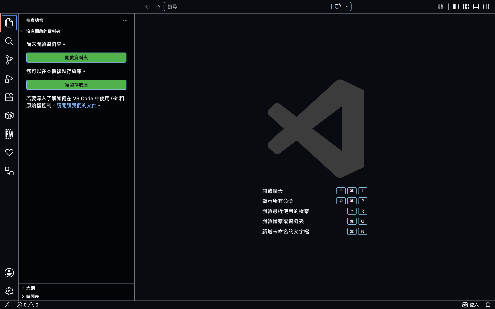
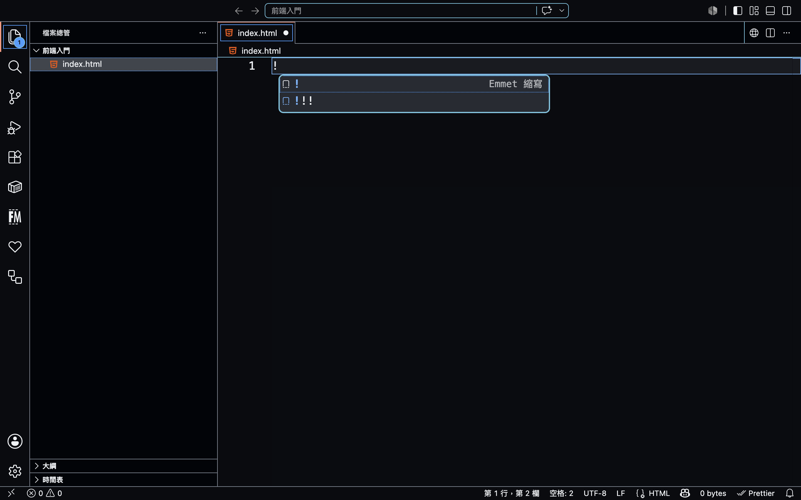
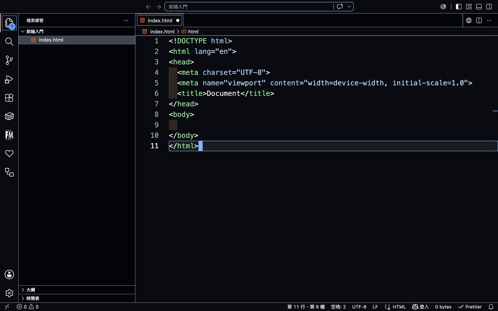

如果你還沒有安裝 vscode，可以先看上一篇[開發環境建構](../blog/前端入門：開發環境建構.md)，馬上就會用到。

## 什麼是 HTML？

HTML（ **H**yper **T**ext **M**arkup **L**anguage），超文字標記語言，如同名字所描述的，它是一種標記語言，並非程式語言，兩個的差異在於，有沒有實質上的程式邏輯語法，例如：可以判斷狀態的 `if...else` 之類的控制語法，但這是一個比較簡易的辨別方式。

不過一般來說，為了方便說明，我們習慣還是會把撰寫的東西稱為程式碼，或者說我們在寫程式。

HTML 本身會透過標記的語法，構築整個網頁的結構，類比的形式很多元，我個人最喜歡用人來類比，HTML 就像人的骨骼、肌肉，之後還會學到 CSS，CSS 就像是人的皮膚，外在的穿搭、髮型，讓每個人看起來不一樣。

不同的結構搭配上不一樣的外觀，會有全然不同的感受，此外如果要說人之所以為人，那是因為我們人類有高貴的靈魂，而網頁的靈魂就是 JS，JS 便可以算是一個真正的程式語言。

## HTML 語法

HTML 是個非常簡單的語言，透過 \< 以及 \> 符號，我們可以產生一個標籤（tag）。

之所以稱為標記或者標籤語言，就是因為這樣的語法形式，如同替每個內容加上標記，好讓瀏覽器可以明白要做什麼事。

一個完整的語法通常會如下所示：

```html
<h1>標題文字</h1>
<p>段落文字</p>
```

一個完整的語法通常會有，`開頭標籤`、`結尾標籤`、以及中間的`內容`物，這樣一個完整的組合，我們稱為一個元素（element）。

需要提醒的是，結尾標籤通常除了 \< 以及 \>，還會有一個斜線 /，不清楚的話可以參考上面的範例標籤。

但是如果單純使用各種不同的標記，確實可以組成一定的結構，卻沒辦法進行一些細節的調整，或者讓程式鎖定特定的元素。

所以通常每個元素會有自己的屬性，即使同樣的標記語法，也可能會有完全不同的屬性，讓每個元素產生獨自的特色，並呈現在頁面上。

屬性通常會埋在`開頭標籤`，例如透過 `id` 屬性鎖定特定元素，讓我們可以透過 JS 的語法去操縱這個元素，或者透過 `class` 屬性，相同類型的元素，加上同一類型的樣式，也就是 CSS 的語法裝飾我們的網頁元素。

## HTML 結構

我們說 HTML 是網頁的骨架，骨架就應該支撐起整個網頁的結構，那麼實際上的結構長怎樣？

網頁的結構很簡單，如果你已經下載了 vscode，請隨意建立一個資料夾（或稱目錄），在其中建立一個名為 `index.html` 的檔案，副檔名務必要是 `.html` 這樣作業系統才有辦法識別這是一個網頁，透過系統設定好的機制，當你點選這個檔案的時候，會透過瀏覽器開啟這個檔案。

建立好檔案後，使用 vscode 開啟這個檔案並且進行編輯。





參考上面兩張圖，開啟 vscode 之後，建立好檔案並且進行編輯，透過輸入 emmet 的指令，也就是一個驚嘆號 `!`，將 HTML 的結構快速產生出來。

輸入驚嘆號後可以使用 `tab` 快速選取 emmet 指令。



上圖是使用 emmet 快速產生 HTML 結構的完成圖，你可以試著使用 `HTML 語法` 提到的程式碼，也就是 `<h1>` 以及 `<p>` 來產生內容，自己輸入看看，並且查看結果。

直接點擊檔案就會透過瀏覽器開啟這個網頁了，如果沒有顯示內容在網頁的上的話，你可以簡單的自行除錯（debug）一下，檢查 \< 以及 \> 是不是輸入正確，有沒有正確的替元素加上結尾標籤。

如果語法沒有問題，參考一下上圖，在編輯區塊的頁籤部分，檔名後面有一個小小的白色實心圓點，如果出現這個，表示你的檔案忘記存檔啦！！

接下來，來稍微深入一點說說這個 HTML 結構。

這段程式碼，在不加上 `<h1>`、`<p>` 標籤的情況下，總共 11 行，我們會使用這個範例講解。

第 1 行的 `<!DOCTYPE html>` 這行語法告訴瀏覽器，這個檔案是 HTML5 的 HTML，請使用相應的語法去解析程式碼。

第 2 行到第 11 行，由 `html` 元素包裹 `head` 以及 `body` 兩個元素，這樣一層一層包裹的結構也稱為**巢狀結構**，而 `html` 也稱為**根元素**，整份 HTML 文件只會有這一個。

`head` 以及 `body` 元素，分別對應的是網頁中介資料以及網頁內容的部分。

`body` 的部分很好理解，就是你實際上會在網頁上看到的內容。

關於 `head` 使用中介資料這個詞比較不好理解，可以簡單地將中介理解為，用資料去解釋資料，這些資料實際上不會出現在網頁上面，而是被網頁拿來利用的資料。

我們透過 `meta` 這些語法，去告訴瀏覽器，這個網頁要使用什麼編碼去解析，以這邊來說的話是透過 `UTF-8` 這個編碼格式，也稱為萬國碼，`title` 則告訴瀏覽器，這個網頁的標題該是什麼，這個資訊會出現在網頁的頁籤部分。

如果你還是不太清楚我在說什麼，可以試著修改 `title` 的內容，將 Document 這段文字，修改成你想要的任何頁面標題。

## 結

我盡可能的不要花太多的篇幅深入每個語法，一來，我相信耐心是有限的，二來， AI 時代，誰還跟你傻傻的一個一個字慢慢敲，趕快學會概念讓 AI 幫你打工吧！

但是萬一，我是說萬一，你有點好奇更多的語法，以及如果今天想要加個圖片怎麼做？你可能需要知道 `` 這個語法，以及怎麼指定圖片的路徑給 `img` 元素的 `src` 屬性，那麼這裡就賣個關子，讓你自行參考下面的參考連結自行學習去。

## 參考連結

- [W3schools - HTML](https://www.w3schools.com/html/html_intro.asp)
- [MDN - HTML](https://developer.mozilla.org/zh-TW/docs/Learn_web_development/Core/Structuring_content/Basic_HTML_syntax)
