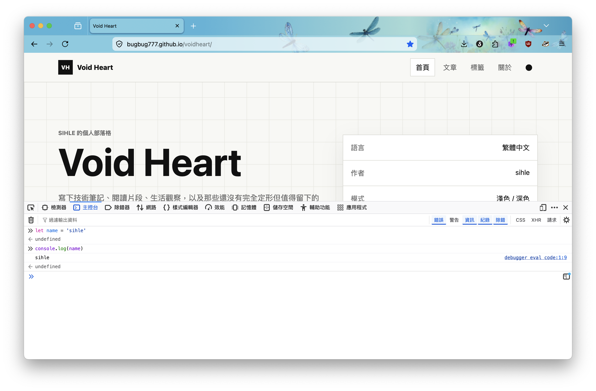

## 什麼是 JS？

JS（ **J**ava**S**cript ），你可能曾經看過 Java 這個程式語言，但是這是兩種完全不同的語言，主要的差異在於 JS 直譯式，而 Java 是編譯式的語言，簡單的解釋是，JS 是逐行編譯後就能執行，Java 則要整個程式進行編譯。

也因此，編譯式的語言通常會有比較良好的效能，但是在現代的應用場景，JS 已經能夠符合大部分的使用場景，所以效能通常不會是特別大的問題，更多的是因為 JS 的靈活性以及易用性，也因此 JS 是 Web 開發中相當熱門的語言之一。

JS 當初只花了 10 天作者就將這個語言開發出來，早期的網站大多都是靜態的，就跟看報紙一樣，如果你想要翻頁，網頁就需要整個重載，並且也沒有任何互動的效果，當時非常火紅的 Netscape 瀏覽器公司，希望幫這個無聊的世界，來點聲響，所以讓旗下的工程師做出了改變世界的 JS。

雖然早期的 JS 就像個玩具一樣，可以做的事情有限，但是隨著技術的進步，如今看到的所有效果、功能、服務，基本上或多或少都跟 JS 扯得上關係，不論前、後端你都可以看到他的身影，或者有所謂的 Javascript stacks，前後端都採用 JS，讓整個前後台能達到開發一制性的目的。

JS 是個相當有趣的語言，希望你也會喜歡。

## JS 語法

雖然我很想簡單的將 JS 的所有語法，用簡單的幾行文字就說明清楚，但是與前面的 HTML 以及 CSS 這兩個偽程式語言不同，JS 是貨真價實的程式語言，沒辦法簡單的用幾行歸納的文字，就將所有語法以及概念說明清楚。

所以以下會簡單的帶出一些概念，並且搭配一些語法，讓你慢慢的進入程式開發的世界。

### 什麼是變數？

變數會是你進入程式開發第一個學習到的概念，概念上很簡單，可以把變數想像成是一個容器，就是用來裝載資料的，當然深入研究的話，實際上會跟記憶體位址有關，但是那個會有些複雜，所以變數它就是一個容器，理解到這邊就行。

一般而言，程式語言都會定義一些基本的資料型別，例如：Number、String、Boolean、Object，不同型別的資料，會被裝進被我們賦予不同名稱的變數，變數名稱通常也稱為識別字（Identifier），但就稱它為變數就是了。

變數可以讓我們針對相同的資料進行重複利用，也能讓程式的控制流程的語法進行控制，進一步得到根據不同的資料，達成不一樣結果的能力。

```javascript
// 變數
var name = 'sihle' 

// 變數
let name = 'sihle'

// 常數
const name = 'sihle'

console.log(name)
//
```

上面是簡單的語法範例，透過 `console.log` 這個語法，我們可以將 `name` 這個變數中的值，印在 console 上，console 在前端語境中，通常指稱的是瀏覽器的開發工具中的終端介面，但是這樣可能會讓有些人誤會，總之就是下圖的樣子。



這是瀏覽器中的開發者工具介面，上圖是 Firefox 的開發者工具的樣子，如果你使用的是其他的瀏覽器，開發者工具的介面會有些許不同，但是功能基本上是大同小異。

### 流程控制

流程控制一般來說可以簡單分成兩種。

`if...else` 判斷式，透過條件邏輯判斷，如果為 `true` 就執行一段程式碼，為 `false` 也執行一段程式碼，你可以決定各自的區塊中要執行什麼程式。

以及迴圈控制，迴圈常有人舉 for loop 為例子，但其實除了 for loop，還有 while loop，依照使用條件的不同，使用場景的迥異，可以有不一樣的效用，迴圈概念在於重複執行有限次數的相同程式碼，當然事實上可以無限次，就如同字面上的意思，迴圈。

```javascript
let age = 18

// if...else
if (age >= 18) {
    console.log('老了')
} else {
    console.log('小年輕')
}

// for loop
// 把數字從 0 ~ 4 印出來，總共印 5 次。也可以將想要執行的程式碼放在該區塊，執行 5 次。
for (let i = 0; i < 5; i++) {
    console.log(i)
}
```

條件判斷以及迴圈的介紹，遠不止上面舉的簡單例子，可以參考最下面的參考連結，進一步去學習更多的語法。

### Functions

函式（Function），可以把它想像成是一個工廠，裡面的程式碼就是你的流水線，以及一些相關機器的配置，製作產品的時候把東西的原料丟進去（Input），你就會得到對應的結果（Output），而且這樣的行為可以重複執行，換句話說就是我們可以重複使用相同的程式碼，使用得當可以有效提升程式碼的可讀性以及程式碼使用的效率。

```javascript
let wetherStatus = 'rainy'

function  isRaining(status) {
    if (wetherStatus === 'rainy') {
        console.log('要記得帶傘')
    } else {
        console.log('小心野獸出沒')
    }
}

// 雨天
isRaining(wetherStatus)

// 晴天
wetherStatus = 'sunny'
isRaining(wetherStatus)

```

function 的使用方式，會有點類似上面的情況，當然這是最簡單的案例，當情況複雜一點，變數、function 的命名都會是一個考慮的重點。

## 結

JS 的知識量頗為龐大，沒辦法僅用一篇文章就教會你，這邊甚至連入門都稱不上，只是給你一些方向以及概念。

上面的內容其實頗為無聊，如果你真的想知道 JS 魔力，參考下面的參考連結，去了解什麼是 DOM？什麼是 BOM？你會開始慢慢知道 JS 的魅力。

## 參考連結

- [W3schools - JS](https://www.w3schools.com/js/js_intro.asp)
- [MDN - What is JS？](https://developer.mozilla.org/zh-TW/docs/Learn_web_development/Core/Scripting/What_is_JavaScript)
