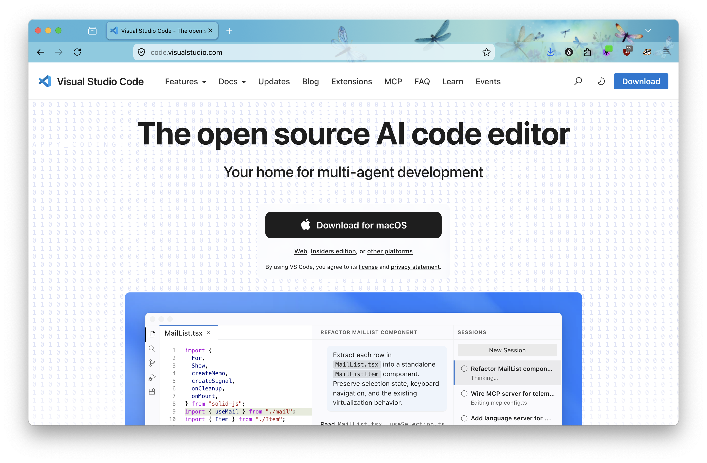
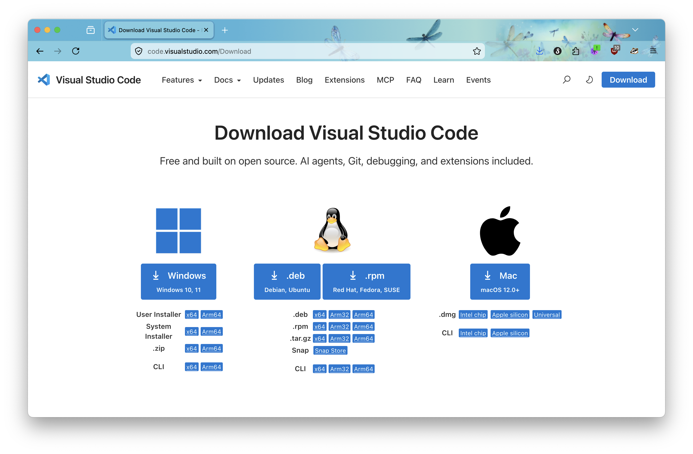
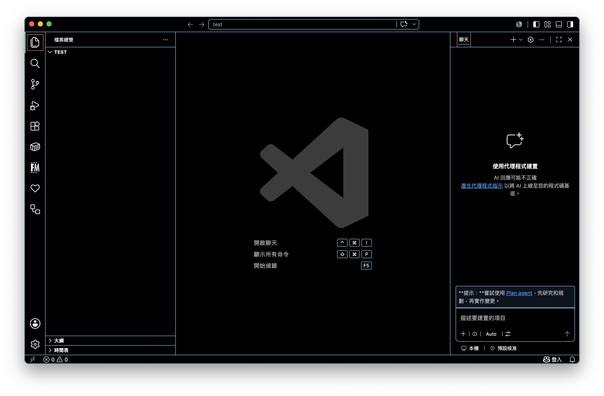

## 開發之前要準備什麼？

- 網頁瀏覽器
- 程式編輯器
- 熱情

## 要使用哪一家的瀏覽器？

市面上瀏覽器各有各的支持者，有人覺得 Chrome 用起來最順，前一陣子也有人說 Edge 很快，Firefox 則是對於新的 Web 標準支援最快，喜歡嚐鮮的支持者頗多，Safari 完全就是信仰啊。

就我自己的體感來說，Chrome 似乎是最少出現問題的，基本上沒有出現過什麼大問題，除了記憶體吃比較兇一點。

而 Edge 似乎有支持的朋友認為比 Chrome 好用，並且效能好上許多，興許是在記憶體的問題上改善不少，不過 Edge 我沒有實際用過，並不太清楚。

Firefox 反而是我比較常使用的，但不是因為對 Web 新標準的愛好，而是從很久以前就一直都有在使用，使用上也沒有發現特別難用的地方，體感上跟 Chrome 差不多。

Safari，好幾次網頁出現奇怪的問題，都是在這個瀏覽器上出現的，通常切換成 Chrome 就解決了，問題通常很難解決，或者是根本解決不了，讓人有點頭痛，根本是現代 IE。

但是近年來，各家瀏覽器的支援度似乎體感上都差不多，也不會出現許久以前的 IE 的各種問題，因此挑選一款你最喜愛的瀏覽器即可，原則上這些瀏覽器都配備開發者工具，但是如果考慮開發者工具的友善程度，也許選擇 Chrome 跟 Firefox 是比較好的選擇。

我自己則是 Firefox 的愛好者。

## 程式編輯器是什麼？

你可以把程式編輯器想像成是一個有外掛的文字編輯器，因為其實我們的程式碼就是有特定規則的一段文字片段，透過不同的排列組合，可以讓我們的程式產生不一樣的結果，所以使用一般的文字編輯器，其實也是可以寫程式，只不過少了語法高亮、語法補齊等等的功能，你在開發程式的同時會非常痛苦，光是排版就夠你喝上一壺的。

程式編輯器就是所謂的 IDE（ Integrated Development Environment ），整合開發環境，把很多功能全部放在一起的開發工具，你可以簡單地這樣理解，市面上有許多熱門的選擇，有些 IDE 則是專門針對某些語言撰寫的，這在沒有 AI 的時代是非常重要的，這會大大提升開發的效率，所以挑選一款好的 IDE 非常重要。

但是先如今幾乎每款 IDE 都已經整合了 AI 的功能，又或者某些 IDE 乾脆省略了撰寫程式碼的功能，直接給你 AI 讓 AI 替你完成所有寫程式碼的工作，這種比較新的開發模式，有人稱為 Vibe Coding，這個有機會再來說說，現在許多部分都不用人工去撰寫程式碼了，大多都是讓 AI 產生程式碼，然後透過 AI 輔以人工去審視程式碼。

不過接下來，為了可以讓你們自己有能力打出程式碼，所以一個優秀的 IDE 是必要的，下面我會簡單介紹一下 Visual Studio Code 這款 IDE，簡稱 VS Code。

## 怎麼用 VS Code？

VS Code 是由微軟發行的開放原始碼 IDE，免費、跨平台、開源，並且開源意味著，開發者有能力自己開發外掛，然後裝在 vscode 上，這給了 vscode 各種的超能力。

並且如果你有使用過現代的 AI 編輯器，例如：Codex、Antigravity 等等，會發現長得跟 vscode 幾乎一模一樣，這就是開源的強大之處。

不過這個系列比較著重在基礎的培養，使用 AI 編輯器當然非常有效率，但是長時間使用這類型工具，你會發現過一陣子，自己好像圖不會「 寫 」程式了，當然我相信觀念還是有的，只不過如果你有體會過這樣的感受，就會明白為什麼基礎還是很重要，因為未來很可能不需要在手動打程式碼了，或者說現在已經是進行式了。

### 下載 vscode

這邊簡單教什麼都不太懂的小白，如何下載 vscode？

上圖是進入官網會看到的畫面，直接點選  `Download for macOS` 你會得到一個 universal 版本的安裝檔，如果不想知道安裝檔案的差異，直接下載這個，完全沒問題，任何 mac 的晶片版本都可以順利運行。

如果你想要下載針對蘋果晶片的安裝版本，也就是 M 系列的晶片版本，在上圖中，下載連結的下面一小排字點選 `other platforms`。

參考下圖，找到蘋果的圖案，然後下方 .dmg 的 Apple silicon 版本，就是我們想要下載的版本。

這兩個版本其實如果你都是使用 Apple 自行研發的 M 系列晶片，執行上不會有任何差異，但是 universal 版本，為了防止使用者不知道自己是使用 intel 或者 apple 晶片，所以把這兩種晶片的安裝版本打包在一起，所以 universal 的檔案會比較肥大，除此之外，沒什麼差別。

### vscode 環境介紹

如上圖，如果你第一次開啟 vscode，你的主題可能不會是這樣，但是你會看到一個類似的視窗。

左側是預設的功能面板區塊，檔案總管、延伸模組、搜尋功能 ⋯⋯ 等等，都會出現在這個區塊。

右側是 Copilot，也就是輔助開發的 AI Agent。

中間區塊通常會是文字內容的呈現區塊，也就是主要面板區塊，通常程式碼會呈現在這裡，只要從左側的檔案總管，點選要編輯的檔案，就會在這個區塊打開，進一步進行程式碼的開發、編輯。

## 結

本來想著好像需要設定一下什麼，但是寫著寫著似乎只要下載、安裝即可，不需要什麼複雜的操作，基本上我們的開發環境就算建構完成了。

之後也許會另外再寫一篇，推薦一些我常用的延伸模組，讓 vscode 的功能更加強大。
